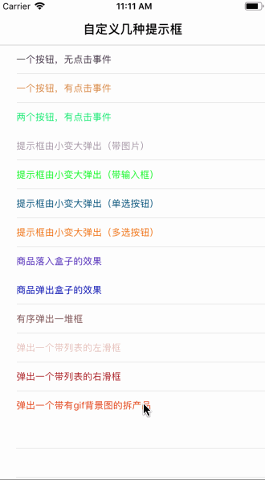

# ZHFToolBox
## 弹框，提示框，自定义弹框，自定义提示框。包含弹出输入框，弹出单选框，弹出多选框，弹出图片，弹出简单的打开奖品的动画效果等，和大家分享高效的自定义自己项目需要的弹框思路。--Swift版本

 
 

### 效果图展现的内容包含下列弹框：

1.有序弹出一些View视图。（带回弹效果）

2.一个类似商品从盒子里弹出来的效果（带回弹效果）

3.一个类似商品从高空掉入盒子的效果（带回弹效果）

4.提示框由小变大弹出（弹出区域放的是一堆按钮，可多选）

5.提示框由小变大弹出（弹出区域放的是一堆按钮，可单选）

6.提示框由小变大弹出（弹出区域放一个带占位文字的输入框TextView）

7.提示框由小变大弹出（弹出区域放一张显示图片，尾部带两个自定义按钮）

8.弹出侧滑视图（侧滑视图带tableView点击跳转）

9.剩下的几个是对系统AlertView封装后弹出的效果

### 自定义这些弹框的思路：

#### 一、弹框结构分析

我们知道弹框的结构基本上都是一个半透明的黑底View，然后上边放一个白色的View。白色View上放自己要在弹框里展示的内容（图片，按钮，文字，输入框等等）。

#### 二、从思路分析中我们可以知道弹框的共性

半透明的黑底View，上边白色的View。这两个是必不可少的。甚至还有一个cancel按钮。

那么我们就自定义一下这个父视图（FatherView），因为我想让这个弹框弹出来时由小变大展示，我就给它起了PopSmallChangeBigFatherView这个名字。

#### 然后我给这个父视图加上下面属性

1.背景区域的颜色和透明度

  var backgroundColor1:UIColor  = UIColor.init(red: 0, green: 0, blue: 0, alpha: 0.4)

2.白色view用来装一些控件

   var WhiteView: UIView =  UIView()

3.WhiteView从什么位置以什么样的大小弹出

   var whiteViewStartFrame: CGRect = CGRect.init(x: ScreenWidth/2 - 10, y: ScreenHeight/2 - 10, width: 20, height: 20)

4.WhiteView在什么位置以什么样的大小停下来

    var whiteViewEndFrame: CGRect = CGRect.init(x: 40, y: 100, width: ScreenWidth - 80, height: ScreenHeight - 230)

5.WhiteView变大变小的动画时间

  var defaultTime:CGFloat = 0.5

  6.取消按钮

   var cancelBtn: UIButton = UIButton()

#### 然后我让这个父视

1.有初始化方法

func initPopBackGroundView() -> UIView

2.弹出效果（弹出按钮被点击）

func addAnimate()

3. 收回的动画效果（取消按钮被点击）

@objc func tapBtnAndcancelBtnClick()

### 三、就开始写一些需要自定义的弹框
就是所有弹框都继承： PopSmallChangeBigFatherView

1.class PopImageView: PopSmallChangeBigFatherView（弹个图、重写override func addAnimate()）在父视图的WhiteView写要弹出的内容

2.class PopTextView: PopSmallChangeBigFatherView（弹个输入框、重写override func addAnimate()）在父视图的WhiteView写要弹出的内容

3.class PopRadioButtonView: PopSmallChangeBigFatherView（弹个单选框、重写override func addAnimate()）在父视图的WhiteView写要弹出的内容

4.class PopCheckboxButtonView: PopSmallChangeBigFatherView（弹个多选框、重写override func addAnimate()）在父视图的WhiteView写要弹出的内容

5.class SlideWhiteViewSubView: SlideView（弹个左右滑视图、重写override func addAnimate()）在父视图的WhiteView写要侧滑展示的内容

### 四、搞个特殊的（一个类似商品（从盒子里弹出来、从高空掉入盒子）的效果（带回弹效果）PopTopOrBottomOutView这个弹出效果和上面那几个不一样。那就继承UIView，以相同的思路写了。）
# PS
如果感觉有用，感谢Star Fork！
